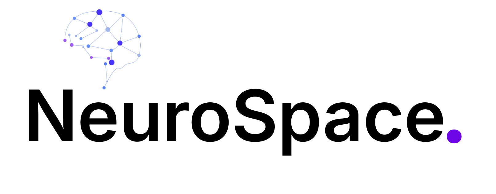
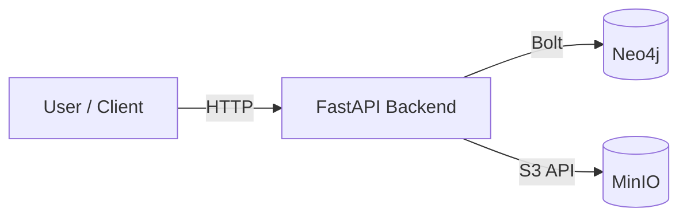
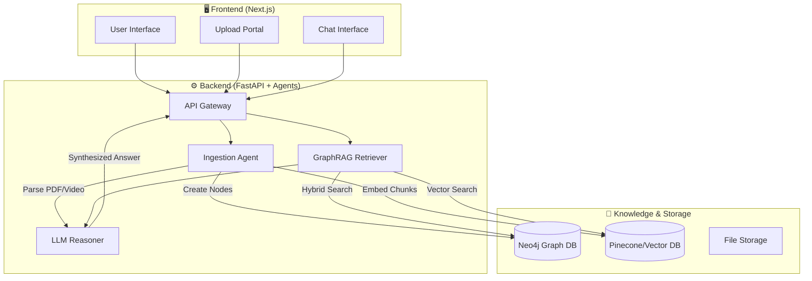
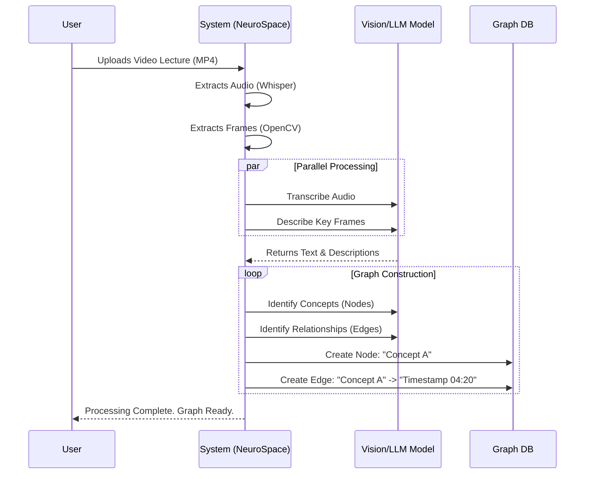

# NeuroSpace



Dev notes / learnings: see [LEARNINGS.md](LEARNINGS.md).

NeuroSpace is a full-stack system for storing, connecting, and querying educational content:

- Videos (MP4)
- PDFs / Documents
- Concepts / Topics

It combines:

- **Neo4j** for graph relationships
- **MinIO** for S3-compatible file storage
- **FastAPI** for the backend API
    
## Architecture



### Diagram 1: System Overview



### Diagram 2: The "Multi-Modal Ingestion" Flow




## Prerequisites

- Docker + Docker Compose
- Python 3.11+
- Git
- FFmpeg (required for `/test-extract` audio extraction)
- Faster-Whisper (for on-device audio transcription)
- pypdf + langchain-text-splitters (for PDF extraction & chunking)

Notes: Install Python libraries into the `backend/venv` (see Quickstart).

## Quickstart

### 1) Clone the repository

```bash
git clone https://github.com/Diluksha-Upeka/Neurospace.git
cd neurospace
```

### 2) Start infrastructure (Neo4j + MinIO)

```bash
docker compose up -d
```

Open dashboards:

- Neo4j Browser: http://localhost:7474
- MinIO Console: http://localhost:9001

Create a MinIO bucket named `raw-uploads` (via the MinIO Console).

### 3) Run the backend API (FastAPI)

```bash
cd backend
python -m venv venv

# Windows
venv\Scripts\activate

# macOS/Linux
source venv/bin/activate

pip install -r requirements.txt
uvicorn app.main:app --reload
```

If you prefer to run from the repository root (no `cd backend`), use:

```bash
uvicorn backend.app.main:app --reload
```

Health check endpoint:

- http://127.0.0.1:8000

Testing endpoints (manual checks)

- POST `/test-extract?video_path=...` — Extract audio from a video (requires FFmpeg). Use Swagger or:

```bash
curl -X POST "http://127.0.0.1:8000/test-extract?video_path=C:\\path\\to\\video.mp4"
```

- POST `/test-transcribe?audio_path=...` — Transcribe `.mp3` audio into time-aligned segments (Faster-Whisper). Use Swagger or:

```bash
curl -X POST "http://127.0.0.1:8000/test-transcribe?audio_path=C:\\path\\to\\audio.mp3"
```

- POST `/test-pdf?pdf_path=...` — Extract & chunk PDF text (pypdf + text splitters). Use Swagger or:

```bash
curl -X POST "http://127.0.0.1:8000/test-pdf?pdf_path=C:\\path\\to\\doc.pdf"
```


## Services & Ports

| Service | Container | Ports | Notes |
|---|---|---|---|
| Neo4j | `neuro_graph` | `7474` (HTTP), `7687` (Bolt) | Default auth: `neo4j/password123` |
| MinIO | `neuro_files` | `9000` (API), `9001` (Console) | Default auth: `minioadmin/minioadmin` |

## Configuration

The backend reads environment variables via `python-dotenv`.

Create `backend/.env` (optional) with:

```env
NEO4J_URI=bolt://localhost:7687
NEO4J_USER=neo4j
NEO4J_PASSWORD=password123

# Optional: if ffmpeg is not on PATH, set the full path to ffmpeg.exe
# FFMPEG_PATH=C:\\ffmpeg\\bin\\ffmpeg.exe
```

Notes:

- `NEO4J_URI` uses `bolt://` (not HTTP).
- If you later run the backend inside Docker on the same Compose network, you’ll likely want `NEO4J_URI=bolt://neo4j:7687`.

## Common Commands

| Task | Command |
|---|---|
| Start infra | `docker compose up -d` |
| Stop infra | `docker compose down` |
| Follow Neo4j logs | `docker logs -f neuro_graph` |
| Follow MinIO logs | `docker logs -f neuro_files` |
| Run backend (from `backend/`) | `uvicorn app.main:app --reload` |

## Current Progress

- Day 1: Infrastructure setup with Docker Compose (Neo4j + MinIO)
- Day 2: Backend skeleton with FastAPI (Neo4j driver + health check)
- Day 3: Video extraction using FFmpeg (`POST /test-extract`)
- Day 4: Audio transcription using Faster-Whisper (`POST /test-transcribe`)
- Day 5: PDF ingestion & chunking using `pypdf` + `langchain-text-splitters` (`POST /test-pdf`) 

## Last Updated

**09th of February 2026**
