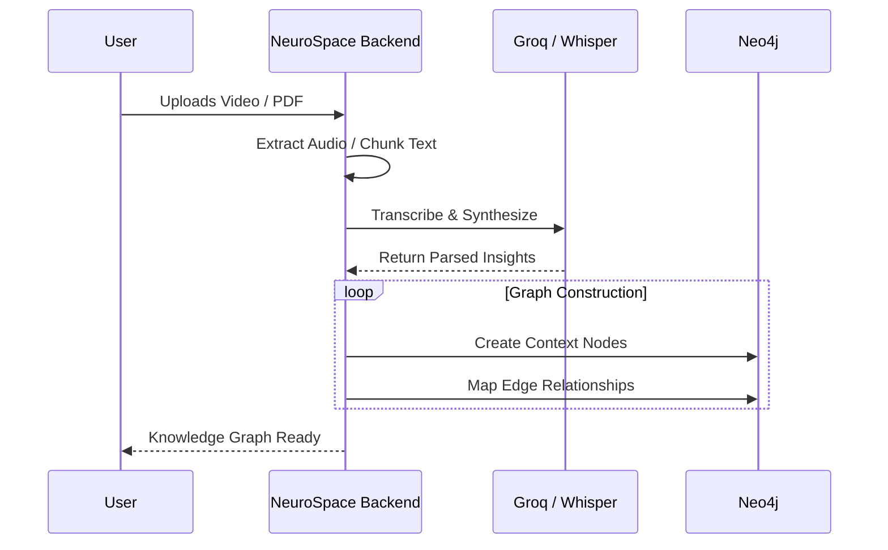
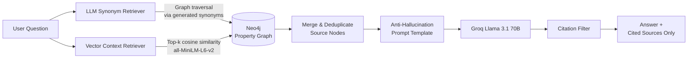
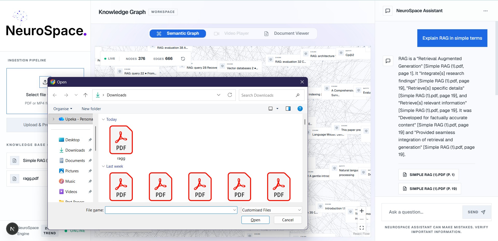

<div align="center">
  
  <!-- <h1>🪐 NeuroSpace</h1> -->
  <p><strong>A Multi-Modal GraphRAG Engine That Turns Lectures Into Queryable Knowledge Graphs</strong></p>

  [](https://www.python.org/)
  [](https://nextjs.org/)
  [](https://fastapi.tiangolo.com/)
  [](https://neo4j.com/)
  [](https://www.docker.com/)
  [](LICENSE)
</div>

<hr />

## 🎬 Demo

<!-- TODO: Replace with your YouTube/Loom link after recording -->
> **▶️ [Watch the 90-second walkthrough →](YOUR_LINK_HERE)**
>
> *Covers the problem, a live GraphRAG query, and what's happening under the hood.*

---

## 🔥 Problem Statement

Educational content — video lectures, dense PDFs, scattered notes — is consumed **linearly** but understood **relationally**. Traditional search treats documents as flat text, missing the conceptual links that make knowledge stick.

**NeuroSpace** solves this by:
1. **Ingesting** multi-modal content (PDFs, video lectures with audio transcription)
2. **Building** a knowledge graph of interconnected concepts in Neo4j
3. **Answering** questions with graph-aware, citation-backed responses using a hybrid **GraphRAG** retrieval pipeline

Instead of keyword matches, you get structurally grounded answers that trace back to exact pages and timestamps.

---

## 🏗️ Architecture

### High-Level System Flow


```mermaid
graph TD
  subgraph Client ["🖥️ Frontend — Next.js"]
    UI[Dashboard]
    Upload[Upload Manager]
  end

  subgraph Server ["⚙️ Backend — FastAPI"]
    API[API Gateway]
    Ingest[Ingestion Pipeline]
    Retriever[GraphRAG Retriever]
  end

  subgraph Data ["💽 Storage & AI"]
    Neo4j[(Neo4j Graph DB)]
    Storage[(MinIO S3)]
    Groq[Groq LLM]
    Embed[Local Embeddings]
  end

  UI --> API
  API --> Ingest & Retriever
  Ingest --> Storage & Neo4j & Groq & Embed
  Retriever --> Neo4j & Embed & Groq
```

### Multi-Modal Ingestion Pipeline

When a video or PDF is uploaded, NeuroSpace parallelizes extraction and structures the content into relational graph nodes.


```mermaid
sequenceDiagram
  participant U as User
  participant S as NeuroSpace Backend
  participant AI as Groq / Whisper
  participant G as Neo4j

  U->>S: Uploads Video / PDF
  S->>S: Extract Audio / Chunk Text
  S->>AI: Transcribe & Synthesize
  AI-->>S: Return Parsed Insights
  loop Graph Construction
    S->>G: Create Context Nodes
    S->>G: Map Edge Relationships
  end
  S-->>U: Knowledge Graph Ready
```

### GraphRAG Query Pipeline

The hybrid retrieval engine combines two strategies before feeding context to the LLM:


```mermaid
graph LR
  Q[User Question] --> SYN[LLM Synonym Retriever]
  Q --> VEC[Vector Context Retriever]

  SYN -->|"Graph traversal<br/>via generated synonyms"| NEO[(Neo4j<br/>Property Graph)]
  VEC -->|"Top-k cosine similarity<br/>all-MiniLM-L6-v2"| NEO

  NEO --> MERGE[Merge & Deduplicate<br/>Source Nodes]
  MERGE --> PROMPT["Anti-Hallucination<br/>Prompt Template"]
  PROMPT --> LLM[Groq Llama 3.1 70B]
  LLM --> FILTER[Citation Filter]
  FILTER --> ANS["Answer +<br/>Cited Sources Only"]
```

---

## 🛠️ Tech Stack

| Layer | Technologies |
| ----- | ------------ |
| **Frontend** | React, Next.js 14, TypeScript, TailwindCSS |
| **Backend API** | Python 3.11+, FastAPI, Uvicorn |
| **Data & Storage** | Neo4j (Property Graph + Vector Index), MinIO (S3 Object Storage) |
| **AI / ML** | LlamaIndex (GraphRAG), Groq Llama 3.1 70B, Faster-Whisper, HuggingFace `all-MiniLM-L6-v2` |
| **Infrastructure** | Docker, Docker Compose |

---

## ✨ Key Features

### 🎥 Multi-Modal Ingestion
Process PDFs into recursive text chunks and MP4 videos into time-aligned, transcribed knowledge graph nodes.

<!-- Screenshot: Upload flow showing a PDF or video being ingested -->
<!--  -->

### 🧠 Hybrid GraphRAG Retrieval
Combines **Vector Similarity Search** (cosine distance on embeddings) with **LLM Synonym Graph Traversal** for pinpoint, context-aware answers with inline source citations.

<!-- Screenshot: Chat interface showing a query, AI response, and cited sources -->
<!--  -->

### 🖥️ Interactive Knowledge Graph
Explore the generated knowledge graph visually. Click on nodes and edges to inspect concepts. Open in a dedicated full-screen tab for deep exploration.

<!-- Screenshot: Interactive graph visualization -->
<!--  -->

### ⚡ Blazing Fast Inference
Groq's Llama 3.1 70B delivers instant responses. Local HuggingFace embeddings (`all-MiniLM-L6-v2`) keep vector search zero-cost with no API calls.

### 🛡️ Anti-Hallucination Guardrails
A strict prompt template forces the LLM to cite exact sources (`[filename, page X]` or `[filename, Xs-Ys]`). A post-processing citation filter strips any uncited sources from the response.

### 📦 Fully Containerized
One `docker compose up` sets up the entire pipeline — Frontend, Backend API, MinIO Storage, and Neo4j Database.

---

## 🚀 Getting Started

### Prerequisites
- [Docker](https://www.docker.com/) and Docker Compose
- A [Groq API Key](https://console.groq.com/) (free tier available)

### 1. Clone the Repository
```bash
git clone https://github.com/Diluksha-Upeka/Neurospace.git
cd Neurospace
```

### 2. Configure Environment Variables
Inside the `backend/` directory, create a `.env` file:
```env
# LLM & Embeddings (Required)
GROQ_API_KEY=your_groq_api_key_here

# Graph Database (Neo4j)
NEO4J_URI=bolt://localhost:7687
NEO4J_USER=neo4j
NEO4J_PASSWORD=password123

# Object Storage (MinIO / S3)
MINIO_ROOT_USER=minioadmin
MINIO_ROOT_PASSWORD=minioadmin
S3_BUCKET_NAME=neuro-uploads
S3_ENDPOINT_URL=http://localhost:9000
```
> A `.env.example` file is included for reference.

### 3. Launch with Docker
```bash
docker compose up --build -d
```
> Initial startup may take a few minutes as Docker downloads models and OS packages.

### 4. Access the Application
| Service | URL | Credentials |
|---------|-----|-------------|
| 🎛️ **NeuroSpace Web UI** | [localhost:3000](http://localhost:3000) | — |
| 🕸️ **Full-Screen Graph** | [localhost:3000/graph/fullscreen](http://localhost:3000/graph/fullscreen) | — |
| 🔌 **Backend API (Swagger)** | [localhost:8000/docs](http://localhost:8000/docs) | — |
| 🧭 **Neo4j Browser** | [localhost:7474](http://localhost:7474) | `neo4j` / `password123` |
| 📦 **MinIO Console** | [localhost:9001](http://localhost:9001) | `minioadmin` / `minioadmin` |

### Local Development (Without Docker)

<details>
<summary>Click to expand manual setup instructions</summary>

**Backend:**
```bash
cd backend
python -m venv venv

# macOS / Linux
source venv/bin/activate

# Windows PowerShell
.\venv\Scripts\Activate.ps1

pip install -r requirements.txt
uvicorn app.main:app --reload
```
> Requires `ffmpeg` on your system PATH for video extraction.

**Frontend:**
```bash
cd frontend
npm install
npm run dev
```

</details>

---

## 🔗 Demo

This project runs locally via Docker. To try it:

```bash
git clone https://github.com/Diluksha-Upeka/Neurospace.git
cd Neurospace && docker compose up --build -d
# Open http://localhost:3000
```

---

## 📄 License

This project is licensed under the [MIT License](LICENSE).

---

<div align="center">
  <sub>Built by <a href="https://github.com/Diluksha-Upeka">Diluksha Upeka</a> · Last Updated: July 2026</sub>
</div>