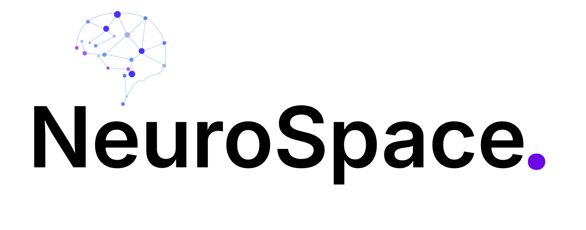
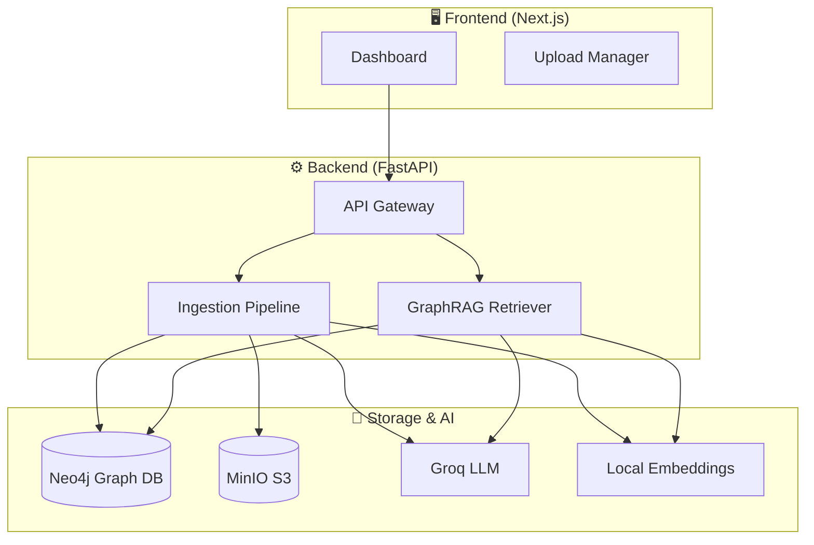
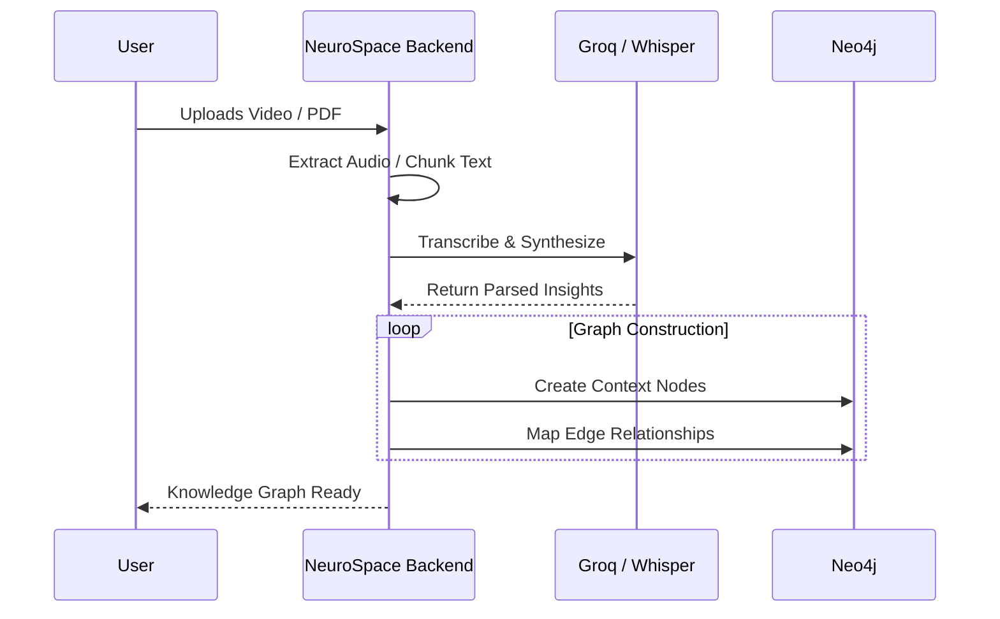

<div align="center">
  
  <h1>🪐 NeuroSpace</h1>
  <p><strong>A Multi-Modal Retrieval-Augmented Generation (RAG) Engine</strong></p>
  
  [](https://www.python.org/)
  [](https://nextjs.org/)
  [](https://fastapi.tiangolo.com/)
  [](https://neo4j.com/)
  [](https://www.docker.com/)
</div>

<hr />

## 📖 Overview

**NeuroSpace** is a complete full-stack solution designed for storing, interpreting, connecting, and querying complex educational content. Be it video lectures, text documents, or intricate relational concepts, NeuroSpace breaks down your content into synthesized nodes of knowledge.

By combining the lightning-fast inference of **Groq (Llama 3.1)** with the structural relational power of **Neo4j**, NeuroSpace redefines how AI understands interconnected data.

## ✨ Key Features

- **🎥 Multi-Modal Ingestion:** Process PDFs into recursive text chunks and MP4 videos into time-aligned, transcribed graphs.
- **🧠 GraphRAG Architecture:** Blends Vector Similarity Search with structural Graph relationships for pinpoint and context-aware LLM generation.
- **⚡ Blazing Fast AI:** Utilizes Groq’s Llama 3.1 models for instant inference and zero-cost local HuggingFace embeddings (`all-MiniLM-L6-v2`).
- **📦 Fully Containerized:** One command sets up the entire pipeline—Frontend, Backend API, MinIO Storage, and Neo4j Database.

---

## 🛠️ Technology Stack

| Layer | Technologies |
| ----- | ------------ |
| **Frontend** | React, Next.js, TypeScript, TailwindCSS |
| **Backend API** | Python, FastAPI, Uvicorn |
| **Data & Storage** | Neo4j (Graph), MinIO (S3 Object Storage) |
| **AI Processing** | LangChain, Faster-Whisper, PyPDF, OpenCV, Groq API |
| **Infrastructure**| Docker, Docker Compose |

---

## 🚀 Getting Started (Using Docker)

Getting NeuroSpace running is incredibly simple thanks to full containerization.

### Prerequisites
- Docker and Docker Compose
- Groq API Key (Obtain from [Groq Console](https://console.groq.com/))

### 1. Clone the Repository
```bash
git clone https://github.com/Diluksha-Upeka/Neurospace.git
cd Neurospace
```

### 2. Configure Environment Variables
Inside the `backend/` directory, create a `.env` file and supply your API key:
```env
NEO4J_URI=bolt://neo4j:7687
NEO4J_USER=neo4j
NEO4J_PASSWORD=password123

GROQ_API_KEY=your_groq_api_key_here
```

### 3. Launch the Application
Run the master compose file to build and network all four containers (Frontend, Backend, Database, and Object Storage):
```bash
docker-compose up --build -d
```
*(Note: Initial startup may take a few minutes as Docker downloads models and OS packages).*

### 4. Access the Ports
Once started, everything is seamlessly routed:
- **🎛️ Neurospace Web UI:** [http://localhost:3000](http://localhost:3000)
- **🔌 Backend API (Swagger):** [http://localhost:8000/docs](http://localhost:8000/docs)
- **🕸️ Neo4j Graph Browser:** [http://localhost:7474](http://localhost:7474) *(auth: neo4j/password123)*
- **📦 MinIO Storage Console:** [http://localhost:9001](http://localhost:9001) *(auth: minioadmin/minioadmin)*

---

## 🏗️ System Architecture

### 1. High-Level Flow
NeuroSpace separates concerns into a clean micro-service flow where an asynchronous Next.js UI communicates with a FastAPI gateway that handles heavy background extraction tasks.


```mermaid
graph TD
  subgraph Client ["🖥️ Frontend (Next.js)"]
    UI[Dashboard]
    Upload[Upload Manager]
  end

  subgraph Server ["⚙️ Backend (FastAPI)"]
    API[API Gateway]
    Ingest[Ingestion Pipeline]
    Retriever[GraphRAG Retriever]
  end

  subgraph Data ["💽 Storage & AI"]
    Neo4j[(Neo4j Graph DB)]
    Storage[(MinIO S3)]
    Groq[Groq LLM]
    Embed[Local Embeddings]
  end

  UI --> API
  API --> Ingest & Retriever
  Ingest --> Storage & Neo4j & Groq & Embed
  Retriever --> Neo4j & Embed & Groq
```

### 2. Multi-Modal Ingestion Engine
When a video is uploaded, NeuroSpace parallelizes audio transcription and visual extraction. The LLM then structures this unstructured content into relational graph nodes.


```mermaid
sequenceDiagram
  participant U as User
  participant S as NeuroSpace Backend
  participant AI as Groq / Whisper
  participant G as Neo4j

  U->>S: Uploads Video / PDF
  S->>S: Extract Audio / Chunk Text
  S->>AI: Transcribe & Synthesize
  AI-->>S: Return Parsed Insights
  loop Graph Construction
    S->>G: Create Context Nodes
    S->>G: Map Edge Relationships
  end
  S-->>U: Knowledge Graph Ready
```

---

## 🧪 Manual Local Development (Without Docker)

If you wish to develop components outside of Docker natively on your OS:

**Backend Setup:**
```bash
cd backend
python -m venv venv
source venv/Scripts/activate  # (Windows: venv\Scripts\activate)
pip install -r requirements.txt
uvicorn app.main:app --reload
```
*Note: You will require `ffmpeg` installed on your system PATH to run video extraction locally.*

**Frontend Setup:**
```bash
cd frontend
npm install
npm run dev
```

---

<div align="center">
  <sub>Built with ❤️ for AI Engineers and Educators.</sub><br>
  <sub>Last Updated: March 2026</sub>
</div>